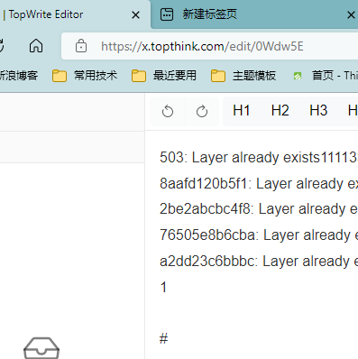

503: Layer already exists1111333
8aafd120b5f1: Layer already exists2
2be2abcbc4f8: Layer already exists22
76505e8b6cba: Layer already exists
a2dd23c6bbbc: Layer already exists
1

#

| 2  |   |
| -- | - |
| 22 |   |
454
分啊发

## fe

## 分

分

## 分fef

分阿飞

分

纷纷

* 分分

  分

  分分

  分

  分
  单位

<<<<<<< HEAD
2

## fefefef
=======
  分
>>>>>>> e657e54 (Update book.json, doc/Docker-compose.md, doc/IDE.md, doc/Pipeline.md, doc/README.md, doc/Schema.md)

fefefefe503: Layer already exists

8aafd120b5f1: Layer already exists

2be2abcbc4f8: Layer already exists

76505e8b6cba: Layer already exists

a2dd23c6bbbc: Layer already exists
503: Layer already exists
8aafd120b5f1: Layer already exists
2be2abcbc4f8: Layer already exists
76505e8b6cba: Layer already exists
a2dd23c6bbbc: Layer already exists
